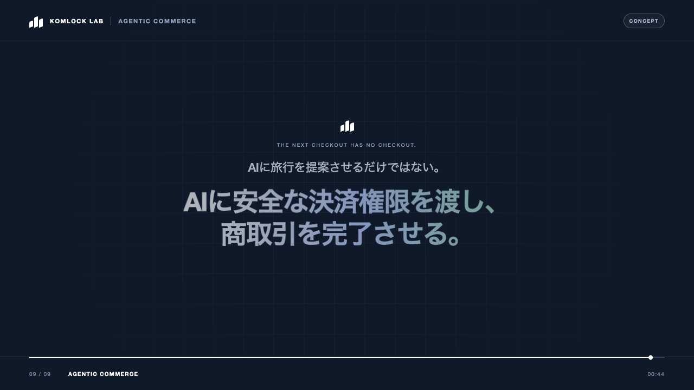

# Agentic Travel Commerce

AIエージェントに、用途・金額・期限を制限した決済権限を渡し、旅行の検索から予約、支払い、例外処理までを一続きで完了させるコンセプトプロジェクトです。

このプロジェクトの目的は、完成した旅行予約サービスを直ちに開発することではありません。イベントで関心を得た後の商談を、PoC・協業・導入検討へ進めるための共通材料を作ることです。

## Core message

> AIに旅行を提案させるだけではない。  
> AIに安全な決済権限を渡し、現実の商取引を完了させる。

旅行は、複数事業者、在庫変動、キャンセル条件、部分失敗、返金が一つのワークフローに含まれるため、Agentic Commerceの価値を短時間で伝えやすい題材です。

## Direction

- デモの入口はChatGPTに固定し、MCP toolsと会話内UIで実際の操作感を検証する
- 決済を主役にせず、改善された旅行手配UXの中へ自然に組み込む
- 最初の決済はカードSandboxを標準とし、ステーブルコインは交換可能な追加レールとして扱う
- AIモデルに秘密鍵や無制限の決済権限を渡さない
- 正常系だけでなく、価格変更、在庫切れ、承認要求、拒否、返金まで見せる
- 動画上の演出と、実装済みの機能を明確に区別する
- Kovaを前提にせず、将来接続可能なPayment Adapterの一つとして扱う

## Current phase

現在は `Phase 0.5: Interactive UX validation` です。

現在の成果物は次の3つです。

1. イベントや初回商談で使用する約90秒のコンセプト動画
2. 動画を見た企業と具体的なPoCを議論するための設計資料
3. ChatGPT上で会話、比較、委任条件、承認、Sandbox決済、例外処理を触れるデモ

## Concept films

[45秒のイベント向けShort cutを再生する](assets/video/agentic-travel-commerce-concept-45s.mp4)

[90秒の商談向けDetailed cutを再生する](assets/video/agentic-travel-commerce-concept.mp4)

- 1280×720 / 20fps
- 日本語の仮ナレーション付き
- 画面はすべて `CONCEPT UI`
- 決済部分は `CONCEPT TRANSACTION` であり、実送金ではない

外部公開版では、仮ナレーションを正式な収録音声へ差し替えることを推奨します。

動画のソースは [prototype](prototype/) にあります。ブラウザ上で再生・スクラブでき、文言、タイミング、ブランド表現を編集した後にMP4を再生成できます。

## Documents

- [コンセプト](docs/concept.md)
- [デモシナリオ](docs/demo-scenario.md)
- [ChatGPT UX仕様](docs/chatgpt-ux.md)
- [アーキテクチャ](docs/architecture.md)
- [決済ポリシー](docs/payment-policy.md)
- [PoCロードマップ](docs/poc-roadmap.md)
- [商談での使い方](docs/sales-followup.md)
- [動画ストーリーボード](storyboard/scenes.md)
- [モーションプロトタイプ](prototype/)
- [ナレーション原稿](prototype/voiceover.txt)

## What this is not

- AIが無制限に資金を使えるウォレット
- ブロックチェーンを使うこと自体を目的にした旅行アプリ
- 実在する旅行商品の予約完了を装う動画
- 特定のウォレット、チェーン、ステーブルコインに固定した製品仕様
- 法務、会計、資金移動、旅行業に関する実運用要件を検証済みとするもの

## Decided for the interactive demo

- ChatGPT Pluginとして実装する
- 旅行在庫は再現可能なモックを使う
- 決済はカードSandboxを標準にする
- ステーブルコインは必須条件にせず、Payment Adapterの差し替え例として残す
- 成功だけでなく、価格上昇による再承認とポリシー違反の拒否を実演する

## Background

Komlock Labが公開している方向性については、以下を参照しています。

- [Komlock Lab](https://komlock-lab.com/)
- [Kova](https://kova-agent.com/)

本プロジェクトはKovaの機能拡張ではなく、Komlock LabがAgentic Commerce領域で何を提供できるかを検証する独立したリファレンス企画です。
